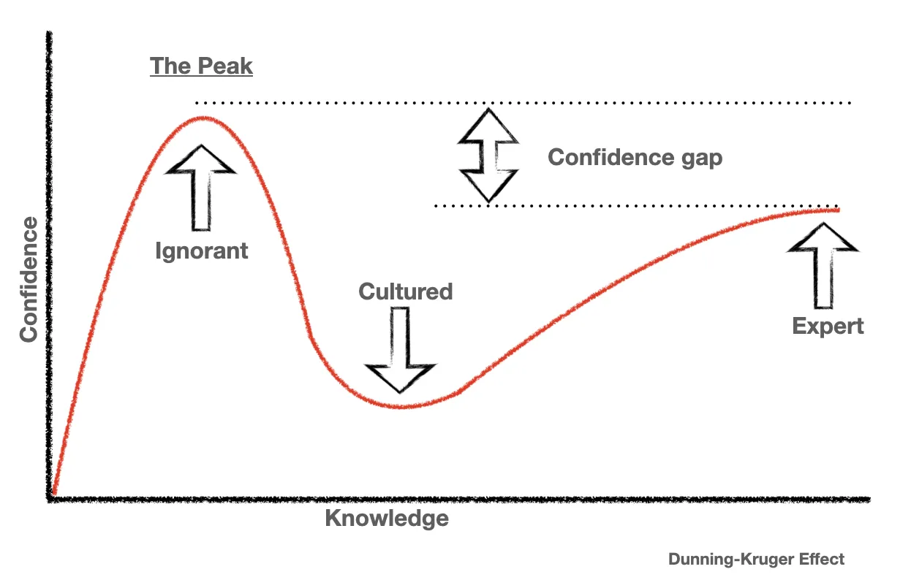

_When I first saw a demo of a use case where GPT-2 was used to interpret user input 
and transform it into a JSON structure that could be sent to our backend, I was kind of 
blown away. I suppose that's how many people felt after using ChatGPT for the 
first time. But now, the honeymoon is over. At least, it seems over to me._ 

|  |
|:--:| 
| *The Dunning Kruger effect* |

## Mood swings

Ah, don't we all love the honeymoon phase? Floating on a cloud like nothing bothers 
us. We are amazed by everything. And I'm not even talking about real marriage between 
people—this blog post is targeted to developers, after all. Getting a new smart phone for
example. Everything feels fresh and exciting. Its flaws are just considered flukes. That's the 
same feeling I had when using ChatGPT for the first few times. I was amazed by what it 
could do and it's capabilities seemed endless.

However, time went by and its flaws became apparent... And boy, did they hit hard. Nonexistent APIs, 
outdated external packages, spaghetti code, premature 
optimization and so on. Suddenly the tools I was using felt alot like myself when I was starting out. They 
were making mistakes I also could've made. The duality in responses drove me crazy. Either they 
were just plainly brilliant or they were painfully wrong. 

Everybody (or thing I suppose) makes mistakes. But finding a bug in code that I didn't write is objectively harder than 
debugging something I wrote yourself. And that's where I take issue with everyone promoting LLMs as a way to become better at programming.
Making mistakes is key to learn. If instead LLMs makes all the mistakes, what's there to learn? Even worse, 
if a system spoon-feeds you the answer, there is a vital part of learning missing.

Whatever Github tells you their [own study](https://github.blog/news-insights/research/research-quantifying-github-copilots-impact-on-developer-productivity-and-happiness/) found, It's not always a bed of roses.

## Productivity

But LLms give productivity a boost, right? As always, the consideration between the long term and the short term is a big factor here. 
AI tools help you go fast. There's no denying it. Don't know the syntax of that particular 
thing? No worries, AI will give you the answer. Tired of writing the types for a certain 
object? No worries, AI will generate the stupid boilerplate for you. For those instances, 
AI is amazing. But let's be honest. The code is not always what you wanted, right?

That is especially dangerous for newer developers or people learning 
new programming languages. People tend to overestimate their abilities. 
Ya know, the Dunning-Kruger effect. But, just for fun, try to stop using AI for 
a while. You'll notice the urge to press tab anytime you write something. You'll notice 
the "Copilot pause," that brief moment where you wait for code to autocomplete.

That's why I think it also harms your productivity. If you're only productive 
with the tooling enabled, are you really productive?

## What's the harm

So what? The tools are available. Why not use them? Fair point—but let me make a 
counter-argument. What if the tools suddenly become unavailable? Let's say, due to a price 
increase. [That scenario is not that far-fetched](https://x.com/sama/status/1864736282276171810).

OpenAI made $3.7B in revenue this year (2024). But that revenue isn't nearly enough. 
[They will lose about $5B this year](https://foundationcapital.com/why-openais-157b-valuation-misreads-ais-future/). 
Training LLMs apparently costs a lot of money. [It also takes a lot of electricity]
(https://www.reuters.com/markets/deals/constellation-inks-power-supply-deal-with-microsoft-2024-09-20/) so there's 
even an ecological argument to be made here, which seems kinda ignored for now.

It boils down to this: AI tools are artificially low priced. I don't know what will happen 
but this business model seems not really viable. So it's either find a way to make a lot 
of money, or there's the other option: Charge the customer. 

## My two cents

Use it. It can be a real gamechanger if used correctly. Please don't use it as a Swiss knife to answer all your questions. 
Google suffices most of the time. Consider the drawbacks, and keep challenging yourself. 
