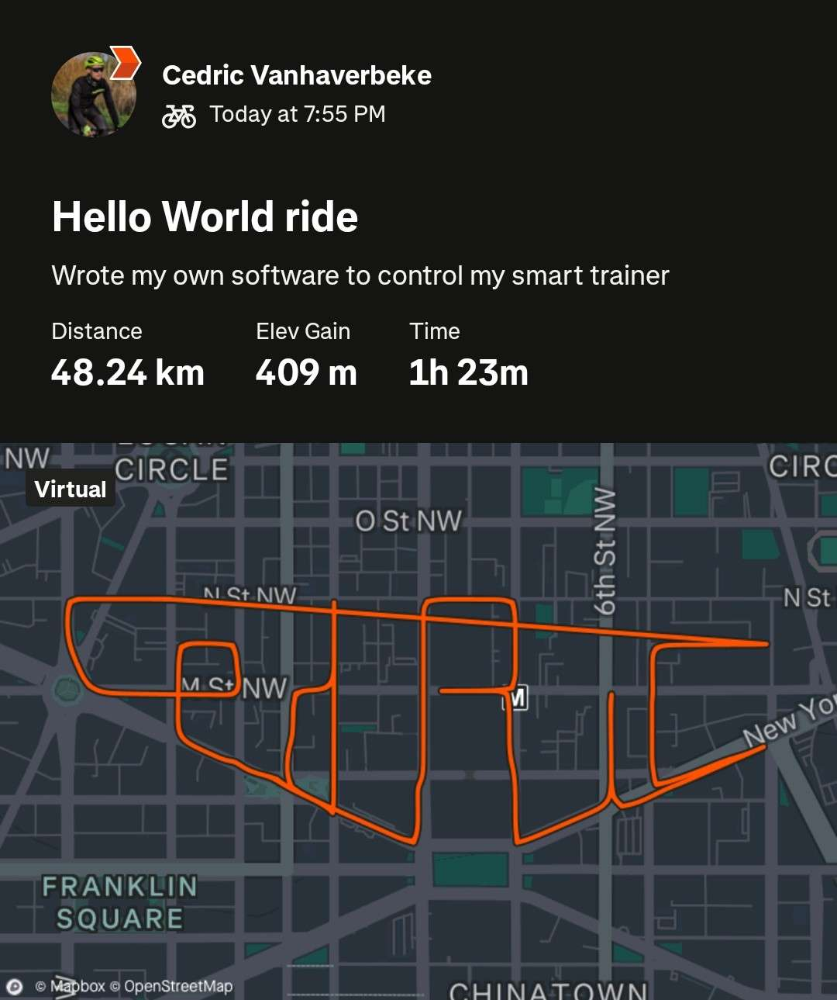
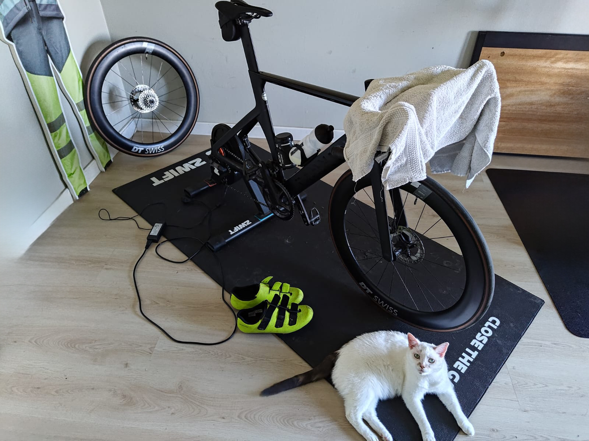
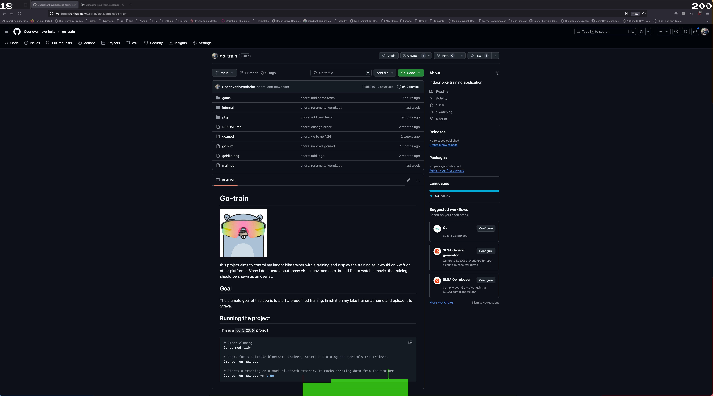

<style>
@media only screen and (max-width: 768px) {
table img {
width: 100% !important;
}
}
article * {
    font-size: 1.1em;
}

table {
    border: 0 !important;
}

table img {
width: 50%;
}


th, td, tr {
    border: 0 !important;
}


ul li {
	list-style-type: disc;
	line-height: 1.1em;
	font-size: 1em;
}

table * {
    font-size: 1em;
    border: 0;
}
</style>

> Disclaimer: This project is open source and can be found [here](https://github.com/CedricVanhaverbeke/go-train).


_I have been using Zwift and MyWhoosh to cycle at home during the colder winter months. I always wondered
how those platforms actually worked. Somehow my smart trainer was controlled by that software over Bluetooth.
It shouldn't be that hard to create my own program that does the same thing as Zwift or MyWoosh, right?
Turns out it isn't, and I had a lot of fun making it._

|  |
|:--:| 
| *My first custom route. Can you spot my name?* |


## The goal

The goal was simple: I wanted to replace Zwift. This means being able to start a predefined workout, show its 
progress, controlling the smart trainer in the process and eventually generate a GPX file I could upload to 
Strava. 


## Creating a workout

Unlike riding a bycicle outdoors, an indoor training offers a more structured workout.
It's possible to predefine what exact force you want to apply on the pedals. This force 
is expressed in an amount of wattages. So a workout becomes a sequence of training blocks,
each with it's own power. In code, a workout is just a list of blocks. Each entry defines 
how much watts must be ridden for a specific amount of time.

```go
func New() Workout {
	return []WorkoutSegment{
		NewSegment(2*time.Minute, 150),
		NewSegment(1*time.Hour, 195),
		NewSegment(30*time.Second, 300),
		NewSegment(30*time.Second, 200),
		NewSegment(30*time.Second, 300),
		NewSegment(30*time.Second, 200),
		NewSegment(20*time.Minute, 195),
		NewSegment(2*time.Second, 150),
	}
}
```

An indoor trainer is able to set an exact wattage. Let's communicate with our smart trainer.


## Comminicating with the smart trainer

|  |
|:--:| 
| *My bike on the smart trainer. And a cat* |


A smart trainer essentially is a Bluetooth device that broadcasts which services it offers. 
Since I would be both reading and writing power data to the trainer, I figured I'd only need one service.
However, after experimenting this proved to not be the case. I actually needed both the `Power Service` 
and the `Fitness Machine Service`. The services can be accessed by their `uuids`.

You cannot communicate directly with a Bluetooth service though. For this purpose
there are multiple Bluetooth characteristics. So after playing the `find-the-right-uuid`-game,
I could finally discover all Bluetooth devices near me with smart trainer capabilities.

After connecting to my trainer with an awesome package called `tinygo/x/bluetooth`. it's time 
to start communicating.

If a characteristic implements following interface, it can be used to read and write data in my game.

```go
type readwriter interface {
	Write(int) (int, error)
	ContinuousRead() error

	// will add a listener that receives read updates
	// from the device
	AddListener(chan int) bool
}
```

Here's the implementation for the power characteristic

```go
func (p *powerCharacteristic) ContinuousRead() error {
	err := p.readPwr.EnableNotifications(func(buf []byte) {
		p.listeners.WriteValue(decode(buf))
	})

	return err
}

func (p *powerCharacteristic) Write(power int) (int, error) {
	return p.writePwr.Write(encode(power))
}
```

The `decode` and `encode` functions make sure the little endian representation
of an integer is used when sending and receiving data from the device.


## The UI

  

Since I've been using Zwift and MyWoosh, I knew what I wanted in a cycling trainer UI.
However, I didn't want to focus too much on the UI side so I picked a few UI elements:

- The progress of a training (in seconds)
- An overview of the training
- The power output from the trainer

There's a lot of UI libraries to choose from. However, given the need to update
UI elements every second to show the passing of time, I opted for a game engine called `ebiten`. It's known for its 
simplicity and it's really fun to create a layout. One of the cool things about `ebiten` 
is the possibility to overlay UI elements on the screen, as if they are widgets. So you
could combine a training with watching a movie, great stuff!

To create a game in `ebiten` you only need to define a struct that comfors to following
interface:

```go
type Game interface {
	Update() error
	Draw(screen *Image)
}
```

The three functions are responsible for different aspects of the game. 
Every iteration in the game loop will trigger the `Update` and `Draw` method. 
`Update` is responsible for updating the game state, and `Draw` will draw 
the game according to the state. 

You can of course draw all sprites of the game in the same function, but I took 
a more hierarchical approach. A game consists of sprites that all implement the 
`Game` interface, and the game will just call every sprite in the iteration.
For example: 

```go
func (g *game) Draw(screen *ebiten.Image) {
	for _, s := range g.sprites {
		s.Draw(screen)
	}
}
```

A progress line sprite may be implemented this way:

```go
func NewProgressLine(x int, y int, width int) *progressLine {
	return &progressLine{
		x:     float64(x),
		y:     y,
		width: width,
	}
}

func (p *progressLine) Update(state state.GameState) {
	step := float64(p.width) / workout.Duration(state.Training).Seconds()
	p.x += step // <-- Update the state
}

func (p *progressLine) Draw(screen *ebiten.Image) {
	vector.DrawFilledRect( // <-- draw according to the state
		screen,
		float32(p.x),
		float32(screen.Bounds().Dy()-100),
		float32(1),
		float32(100),
		color.RGBA{255, 0, 0, 50},
		true,
	)
}
```

## Generating the GPX file

This part seems easy. And I agree, I had all elements to just start a workout 
and call it a day. However, my goal was to post a route on Strava just like 
Zwift and MyWoosh do. With those platforms, you're able to see how much distance
was ridden, what your speed was at any time in the workout, what the elevation
level was and so on.

So far, I only had power output at a given time. Generating a route is easy, I could 
just create a route with a tool like [GPX studio](https://gpx.studio/app). The difficult part is 
knowing the location on the route given a certain power output. 

I needed to find a way
to figure out what speed I was traveling at given a start point and a power output.
This results only in a snapshot of the speed of course. I reasoned repeating this calculation every second
would give me a good enough result.

This sounds a lot like a simple physics exercise, and it actually is. Without going too much into
detail I needed a few other variables before I could calculate the speed:

- the slope at a given point.
- the bike's mass
- the rider's mass
- air resistance
- rolling resistance
- air density
- temperature
- efficiency of the drive train

Fun stuff for sure! If you want to check the code, go [here](https://github.com/CedricVanhaverbeke/go-train/blob/029b9d62383b2237e397bde7d0d309dc0091bdaa/internal/physics/speed.go#L9).

So now I had the speed I was traveling at, hooray. So after a second, I also know how far I've travelled.
With that information and some basic math it was possible to determine my location at any given time 
on the route. Success!

An XML ready for import to Strava looks something like this.

```xml
<?xml version="1.0" encoding="UTF-8"?>
<gpx xmlns:xsi="http://www.w3.org/2001/XMLSchema-instance" xsi:schemaLocation="http://www.topografix.com/GPX/1/1 http://www.topografix.com/GPX/1/1/gpx.xsd http://www.garmin.com/xmlschemas/GpxExtensions/v3 http://www.garmin.com/xmlschemas/GpxExtensionsv3.xsd http://www.garmin.com/xmlschemas/TrackPointExtension/v1 http://www.garmin.com/xmlschemas/TrackPointExtensionv1.xsd" creator="StravaGPX" version="1.1" xmlns="http://www.topografix.com/GPX/1/1" xmlns:gpxtpx="http://www.garmin.com/xmlschemas/TrackPointExtension/v1" xmlns:gpxx="http://www.garmin.com/xmlschemas/GpxExtensions/v3">
 <metadata>
  <time>2025-03-10T18:55:04Z</time>
 </metadata>
 <trk>
  <name>Hello World ride</name>
  <type>VirtualRide</type>
  <trkseg>
   <trkpt lat="38.9063020" lon="-77.0318560">
    <ele>26.8</ele>
    <time>2025-03-10T18:56:15Z</time>
    <extensions>
     <power>149</power>
     <gpxtpx:TrackPointExtension>
     </gpxtpx:TrackPointExtension>
    </extensions>
   </trkpt>
   <trkpt lat="38.9062110" lon="-77.0318020">
    <ele>26.7</ele>
    <time>2025-03-10T18:56:16Z</time>
    <extensions>
     <power>151</power>
     <gpxtpx:TrackPointExtension>
     </gpxtpx:TrackPointExtension>
    </extensions>
   </trkpt>
   <trkpt lat="38.9061210" lon="-77.0317480">
    <ele>26.6</ele>
    <time>2025-03-10T18:56:17Z</time>
    <extensions>
     <power>152</power>
     <gpxtpx:TrackPointExtension>
     </gpxtpx:TrackPointExtension>
    </extensions>
   </trkpt>
   <trkpt lat="38.9060350" lon="-77.0316970">
    <ele>26.5</ele>
    <time>2025-03-10T18:56:18Z</time>
    <extensions>
     <power>152</power>
     <gpxtpx:TrackPointExtension>
     </gpxtpx:TrackPointExtension>
    </extensions>
   </trkpt>
    ... more trkpt here
   </trkseg>
 </trk>
</gpx>
```

## Conclusion

This side project was a fun challenge. Controlling and understanding hardware 
I actually use quite often was a fun change of pace. It was a great learning experience 
to delve into the intricacies of Bluetooth communication and the physics of cycling. 
Moreover, the project allowed me to appreciate the complexity behind commercial fitness platforms and the 
effort that goes into creating a seamless user experience. I'm excited to continue refining this project 
and perhaps add even more features in the future, like real time graphical representation of the route.


